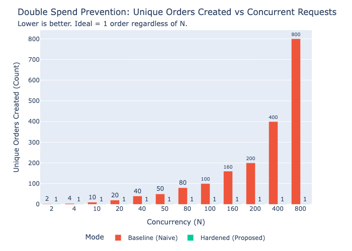
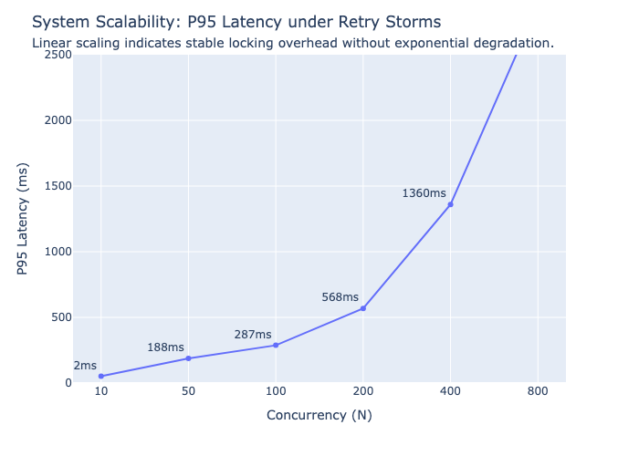

# UCP Agent: Payment Integrity & Idempotency Experiment

[](https://www.python.org/downloads/)
[](https://opensource.org/licenses/Apache-2.0)
[](https://a2a-protocol.org)
[](https://ucp.dev)
[]()

A minimal, high-fidelity implementation of a **Universal Commerce Protocol (UCP)** Checkout Agent over **Agent-to-Agent (A2A)** messaging.

This repository serves as the artifact for an academic study on **Payment Integrity in Agentic Commerce**. It demonstrates how "naive" agent implementations create critical double-spend and state-corruption vulnerabilities, and provides a **production-scalable hardened reference architecture** using:

- **Message-Level Idempotency** (prevents duplicate processing)
- **Checkout-Level Locking** (prevents concurrent races)
- **Database Unique Constraints** (multi-worker duplicate prevention)
- **Optimistic Concurrency Control** (prevents mutation races via versioning)

---

## 🔬 Research Scenarios & Results

We subjected the agent to three distinct concurrency stress tests (N=10 to N=800 requests) in both **Baseline (Naive)** and **Hardened** modes with **4 Uvicorn workers** (multi-process deployment).

### Results at a Glance

| Scenario | Baseline (Naive) | Hardened (Proposed) |
|:---|:---|:---|
| **Retry Storm** (N=800) | 800 unique orders ❌ | **1 unique order** ✅ |
| **Concurrent Race** | Multiple winners ❌ | **Single winner (1 order)** ✅ |
| **Mutation Race** | 36% state corruption ❌ | **0% corruption** ✅ |

### 1. The "Retry Storm" (Network Duplication)
- **Scenario:** A client (or network intermediary) sends the exact same `complete_checkout` message N times in rapid succession.
- **Vulnerability:** Naive agents treat each message as a new intent, charging the user N times.
- **Result:**
  - **Baseline:** 100% Failure Rate. At N=800, **800 unique orders** were created for a single cart.
  - **Hardened:** 0% Failure Rate. At N=800, **exactly 1 order** was created.

### 2. The "Concurrent Race" (Parallel Payment)
- **Scenario:** N distinct users (or devices) attempt to pay for the same shared cart at the exact same millisecond.
- **Vulnerability:** Without locking, multiple threads read the "Unpaid" state simultaneously and proceed to capture funds.
- **Result:**
  - **Baseline:** 100% Failure Rate. Multiple winners in the race, leading to double-spending.
  - **Hardened:** 0% Failure Rate. Database unique constraint ensures only the first request succeeds.

### 3. The "Mutation Race" (The Sneaky Add)
- **Scenario:** User A clicks "Pay" ($20) while User B clicks "Add Item" ($20) on the same cart simultaneously.
- **Vulnerability:** "Dirty Reads." The payment logic reads $20, authorizes $20, but the Add logic commits $40.
- **Result:**
  - **Baseline:** High Failure Rate. At N=200 pairs, **146 inconsistent states** (36% corruption).
  - **Hardened:** 0% Failure Rate. **Optimistic Concurrency Control (versioning)** detects stale reads.

### Visual Results

<div align="center">
  
  <p><em>Figure 1: Baseline allows duplicate orders to scale linearly (red). Hardened enforces exactly 1 order (green).</em></p>
</div>

<div align="center">
  
  <p><em>Figure 2: P95 latency grows linearly, confirming stable database locking overhead.</em></p>
</div>

---

## 🏗 Architecture

### Multi-Worker Production Topology

```
┌────────────────┐
│   Client/LLM   │
└───────┬────────┘
        │
        ▼
┌────────────────┐
│  Load Balancer │
│   (Port 8000)  │
└───────┬────────┘
        │
        ▼
┌───────────────────────────────────────────┐
│      Application Layer (Stateless)        │
│  ┌─────────┐  ┌─────────┐  ┌─────────┐   │
│  │Worker 1 │  │Worker 2 │  │Worker 3 │   │
│  └────┬────┘  └────┬────┘  └────┬────┘   │
└───────┼────────────┼────────────┼────────┘
        │            │            │
        ▼            ▼            ▼
┌───────────────────────────────────────────┐
│     Persistence Layer (SQLite)            │
│  ┌─────────────────────────────────────┐  │
│  │ UNIQUE INDEX idx_orders_checkout_id │  │
│  │ VERSION column for OCC              │  │
│  └─────────────────────────────────────┘  │
└───────────────────────────────────────────┘
```

### Key Safety Mechanisms

| Mechanism | Protection | Layer |
|:---|:---|:---|
| `IdempotencyStore` | Cache responses by `messageId` | Application |
| `LockManager` | Serialize operations per `checkout_id` | Application |
| `UNIQUE INDEX` on `orders.checkout_id` | Prevent duplicate orders across workers | Database |
| `version` column + OCC | Prevent mutation races ("sneaky add") | Database |

### Domain Errors

```python
# Raised on unique constraint violation
class DuplicateOrderError(Exception): ...

# Raised on version mismatch (cart modified during payment)
class StateConflictError(Exception): ...
```

---

## 🚀 Getting Started

### Prerequisites

- **Python 3.11+**
- **[uv](https://github.com/astral-sh/uv)** (Recommended for fast dependency management)

### 1. Installation

```bash
# Clone the repository
git clone https://github.com/your-username/ucp-a2a-payment-integrity.git
cd ucp-a2a-payment-integrity

# Sync dependencies (creates virtualenv automatically)
uv sync
```

### 2. Run the Agent (Hardened Mode - Single Worker)

```bash
uv run uvicorn app.main:create_app --factory --port 8000
```

### 3. Run the Agent (Multi-Worker Production Mode)

```bash
# Delete stale database
rm -f test.db

# Start with 4 workers
uv run uvicorn app.main:create_app --factory --host 0.0.0.0 --port 8000 --workers 4
```

### 4. Verify Functionality (Demo)

```bash
uv run python demo.py
```

---

## 🧪 Reproducing Experiments

### Quick Sweep (All N values, 5 repetitions)

```bash
# 1. Start Hardened Server (4 workers)
rm -f test.db
uv run uvicorn app.main:create_app --factory --host 0.0.0.0 --port 8000 --workers 4

# 2. Run Sweep (in another terminal)
uv run python -m experiments.runner --sweep --mode hardened --reps 5
```

### Baseline Comparison

```bash
# 1. Start Baseline Server (Safety OFF)
rm -f test.db
SAFETY_MODE=off uv run uvicorn app.main:create_app --factory --host 0.0.0.0 --port 8000 --workers 4

# 2. Run Baseline Sweep
uv run python -m experiments.runner --sweep --mode baseline --reps 5
```

### Experiment Options

| Flag | Description | Default |
|:---|:---|:---|
| `--sweep` | Run full sweep across multiple N values | Off |
| `--reps N` | Repetitions per N value | 5 |
| `--n-values "10,50,100"` | Custom N values | `10,50,100,200,400,800` |
| `--storm N` | Single retry storm test | - |
| `--race N` | Single race condition test | - |
| `--mode <name>` | Label for CSV output | `hardened` |

### Generate Plots

```bash
uv run python scripts/generate_plots.py
# Output: docs/plots/integrity_plot.png, docs/plots/latency_plot.png
```

---

## 🛠 Project Structure

```text
.
├── app/
│   ├── a2a/                   # A2A Protocol (dispatcher, schemas)
│   ├── domain/
│   │   ├── errors.py          # DuplicateOrderError, StateConflictError
│   │   └── models.py          # Checkout (with version), Order, Product
│   ├── infra/
│   │   ├── store.py           # SQLite with UNIQUE index + OCC
│   │   ├── idempotency.py     # Message-level response caching
│   │   └── lock_manager.py    # In-process checkout locking
│   ├── routes/
│   │   ├── a2a_rpc.py         # Main A2A JSON-RPC endpoint
│   │   └── well_known.py      # UCP discovery endpoint
│   ├── services/
│   │   └── checkout_service.py # Hardened checkout logic
│   ├── ucp/                   # UCP constants & schemas
│   ├── main.py                # FastAPI app factory
│   └── settings.py            # SAFETY_MODE configuration
├── docs/
│   ├── architecture/          # System design diagrams
│   └── plots/                 # Generated experiment figures
├── experiments/
│   ├── runner.py              # CLI with --sweep mode
│   └── metrics.py             # CSV result writer
├── scripts/
│   └── generate_plots.py      # Plotly figure generation
├── tests/
│   ├── conftest.py            # Shared fixtures
│   ├── test_p1_*.py           # Phase 1: Basic functionality
│   ├── test_p2_*.py           # Phase 2: Idempotency tests
│   └── test_p3_*.py           # Phase 3: Persistence tests
├── demo.py                    # Interactive console chat
├── demo_fail.py               # Demonstration of failure modes
└── pyproject.toml             # Dependencies & config
```

---

## 🔧 Configuration

| Environment Variable | Description | Default |
|:---|:---|:---|
| `SAFETY_MODE` | `on` = Hardened, `off` = Baseline (Naive) | `on` |
| `DATABASE_URL` | SQLite database path | `test.db` |

---

## 🧬 Technical Deep Dive

### Optimistic Concurrency Control (OCC)

The `version` column on `checkouts` table prevents mutation races:

1. **Read Cart:** `version=1`
2. **Add Item:** `save_checkout()` increments to `version=2`
3. **Payment Attempt:** `create_order_safe(expected_version=1)` fails
4. **Result:** `StateConflictError` - cart was modified during payment

```python
# In store.py
async def create_order_safe(self, *, checkout: Checkout, expected_version: int) -> Order:
    # Verify version hasn't changed since checkout was read
    if real_version != expected_version:
        raise StateConflictError(checkout_id, expected_version, real_version)
    return await self.create_order(checkout=checkout)
```

### Database-Level Duplicate Prevention

```sql
CREATE UNIQUE INDEX IF NOT EXISTS idx_orders_checkout_id ON orders(checkout_id)
```

This constraint works **across all Uvicorn workers** - in-memory locks cannot provide this guarantee in multi-process deployments.

---

## 📊 Running Tests

```bash
# Run all tests
uv run pytest tests/ -v

# Run with coverage
uv run pytest tests/ -v --cov=app
```

---

## 📜 License

This project is licensed under the Apache 2.0 License - see the [LICENSE](LICENSE) file for details.

## 🔗 References

- [Universal Commerce Protocol (UCP)](https://ucp.dev)
- [Agent-to-Agent Protocol Specification](https://a2a-protocol.org)
- [System Design Documentation](docs/architecture/system_design.md)
