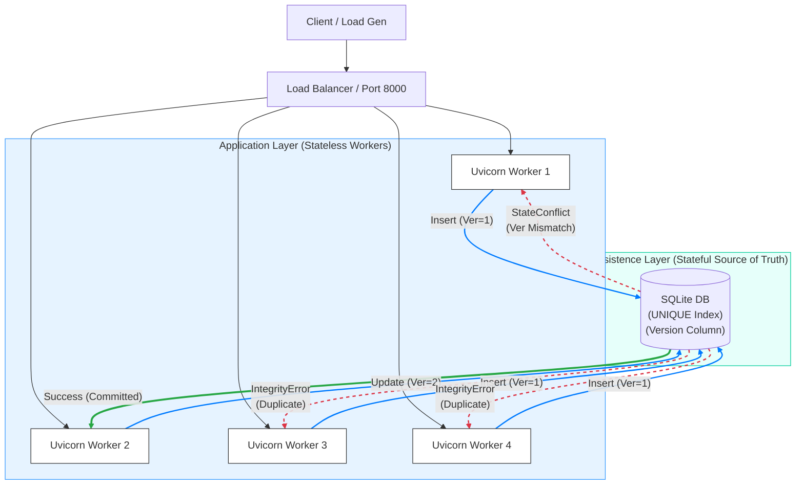
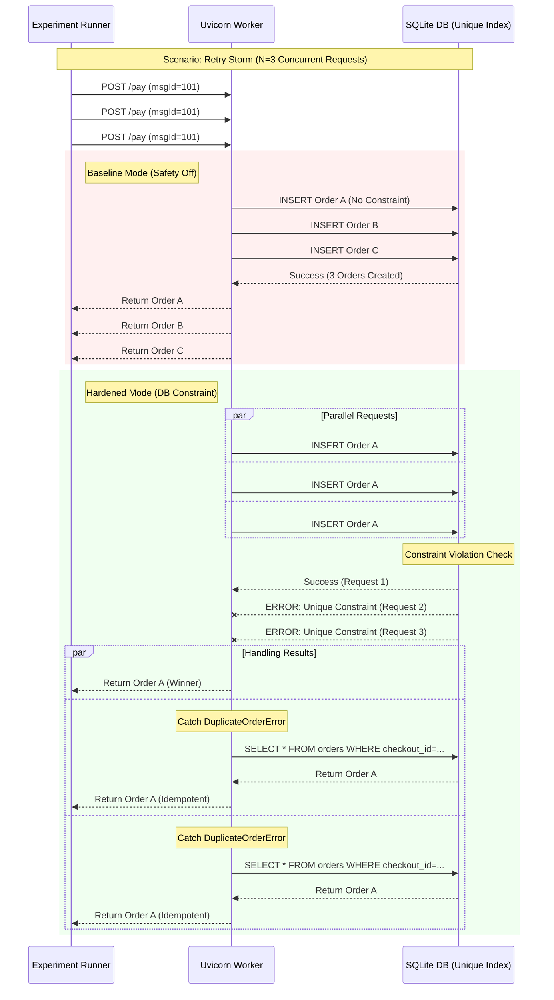
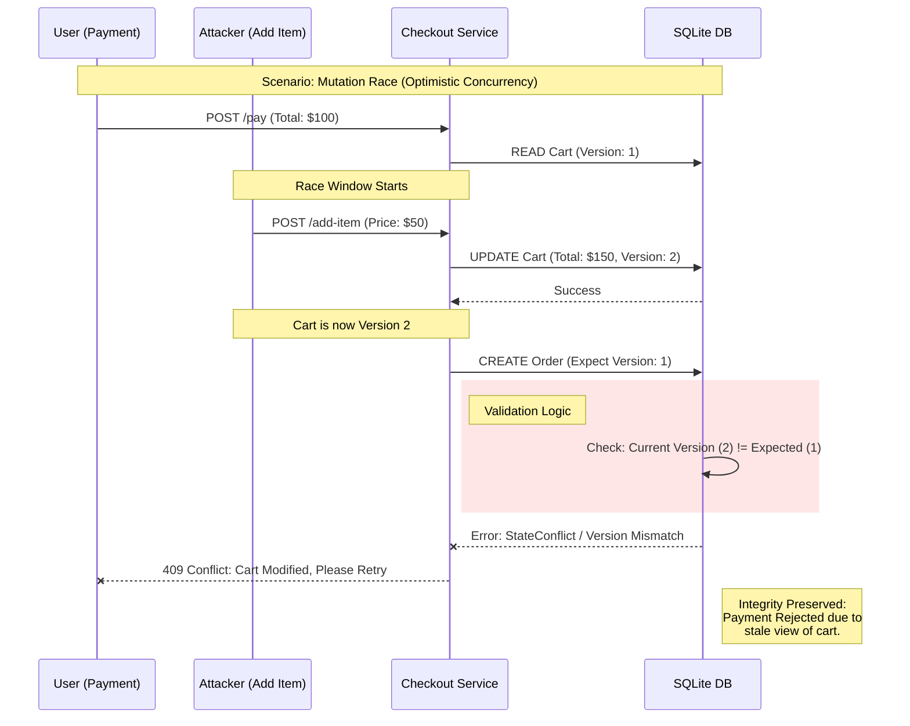
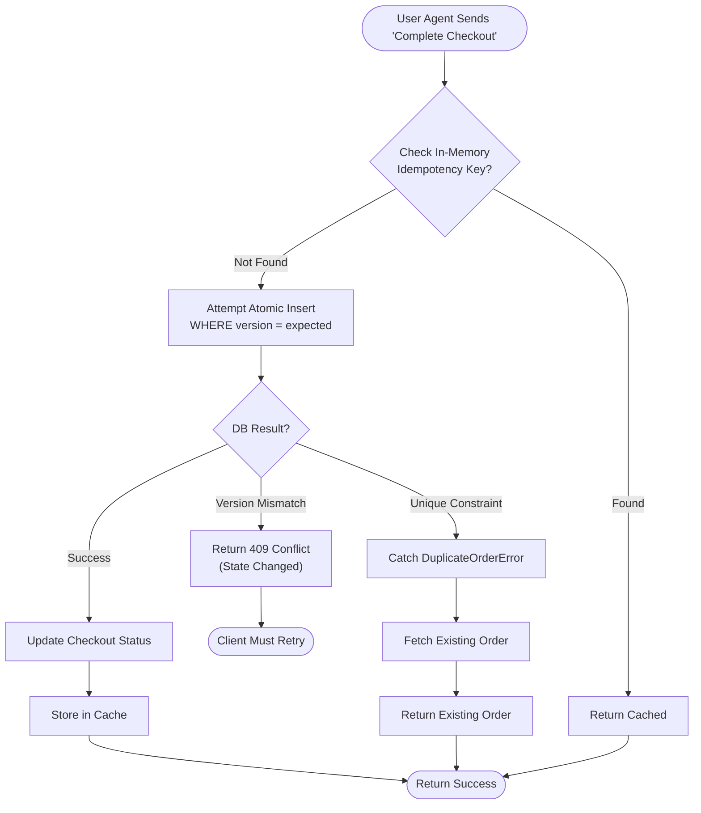
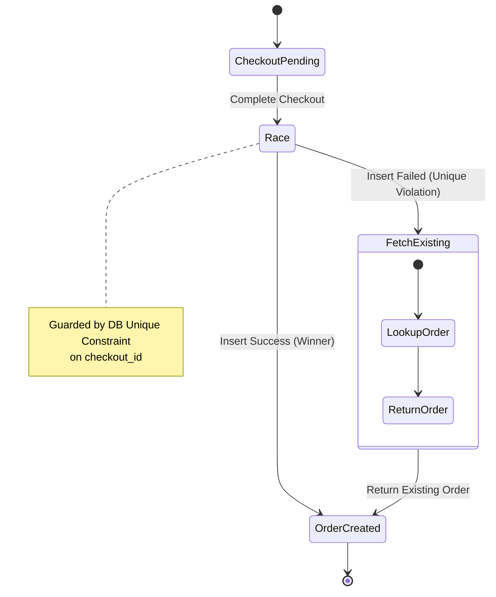
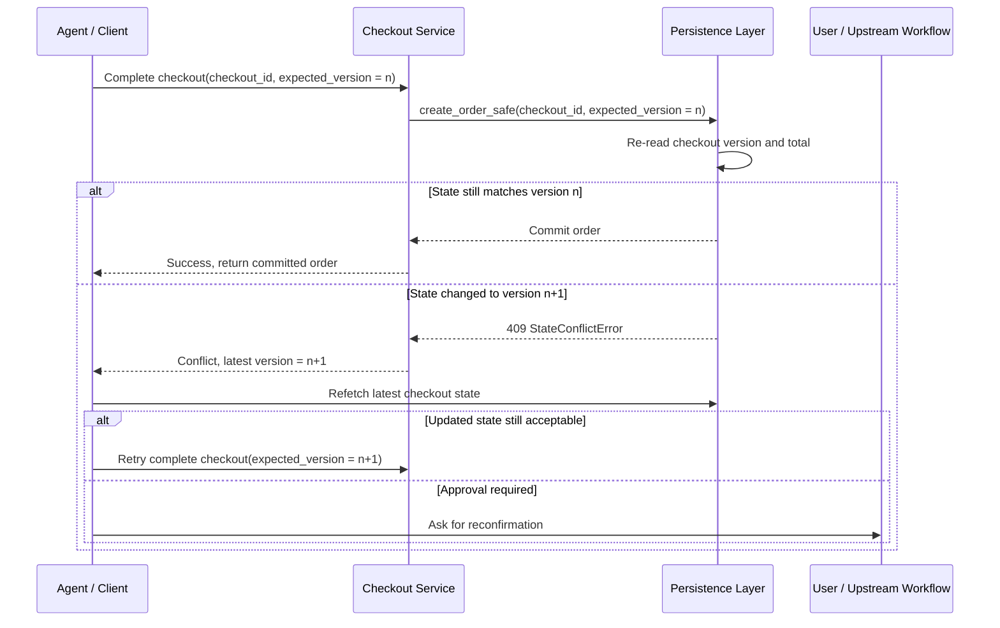

# UCP Agent Architecture & Integrity Design

This document visualizes the architectural patterns used to guarantee payment integrity and state consistency in the Universal Commerce Protocol (UCP) Agent.

## 1. Deployment Topology (Multi-Worker)

Illustrates why in-memory locks fail and why we enforce safety at the Persistence Layer.
- **Blue Arrows:** Concurrent race attempts.
- **Green Arrow:** The successful write (Winner).
- **Red Dashed Arrows:** Rejection signals (Losers) due to Version Conflict or Unique Constraint.

---

## 2. Retry Storm Sequence (Payment Integrity)

Shows how the Database Unique Constraint acts as the "Atomic Guard" against duplicate payments (Double Spend).

---

## 3. Mutation Race Sequence (Optimistic Concurrency)

Shows how Versioning (OCC) detects dirty reads when an "Add Item" request interleaves with a "Payment" request.

---

## 4. Payment Integrity Guard Logic (Flowchart)

The decision tree for handling incoming requests safely.

---

## 5. State Diagram (Order Lifecycle)

Formalizing the idempotent state transition: "Failure to Create" is a valid path to "Success".

---

## 6. Conflict Recovery After OCC Rejection

Shows the post-conflict path after a stale write is rejected: the payment attempt arrives with an expected checkout version, the persistence layer detects that storage has advanced, the write fails with a conflict, and the caller must refetch current state before retrying or asking for reconfirmation.

